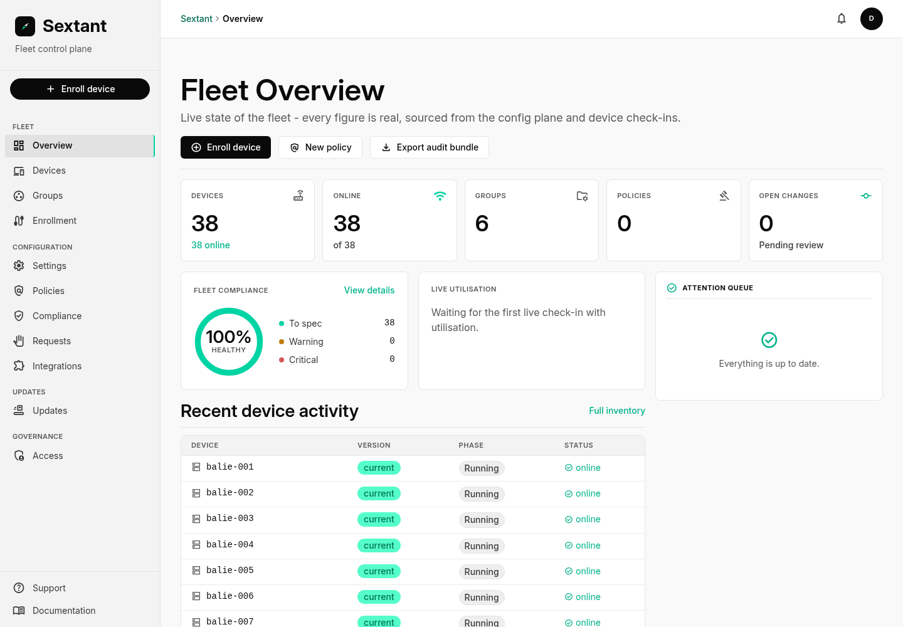
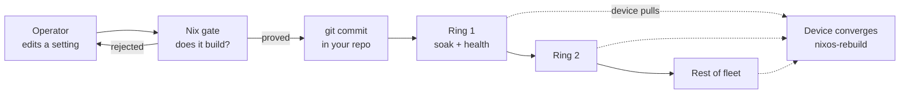
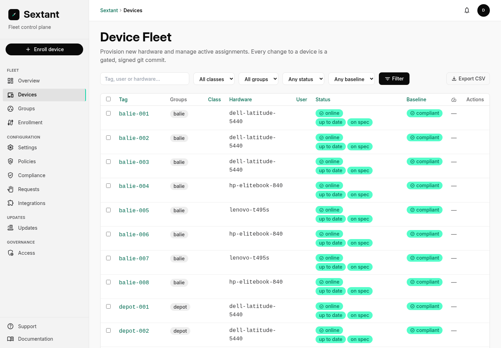

<div align="center">

# Sextant

**Manage a fleet of NixOS workstations the way you manage code.**

[](LICENSE)
[](#status-beta)
[](go.mod)
[](https://docs.sextantfleet.com)

[Documentation](https://docs.sextantfleet.com) ·
[Quickstart](#quickstart) ·
[Decision records](docs/adr/) ·
[Contributing](CONTRIBUTING.md) ·
[Security](SECURITY.md)

</div>

Every device's configuration is data in git. Nix builds it, a gate proves it
compiles before anyone can merge it, and the fleet rolls forward in rings you
control. The console shows you what each machine **actually** runs, not what
you hoped it would.



## Quickstart

Two commands and a browser. No database, no cluster, no account.

```sh
git clone https://github.com/BB-Open-Solutions/Sextant.git && cd Sextant
just demo          # builds, seeds an example fleet, serves on :8080
```

Then open **http://127.0.0.1:8080**. You get a working console on the example
fleet in `examples/overlay`: enroll a device, change a setting, watch the
change become a git commit.

<details>
<summary>No <code>just</code>?</summary>

```sh
go build -o sextant ./cmd/sextant

# the config plane is a git working tree, so give the demo one
cp -r examples/overlay /tmp/sextant-demo
git -C /tmp/sextant-demo init -q -b main
git -C /tmp/sextant-demo add -A
git -C /tmp/sextant-demo -c user.name=demo -c user.email=demo@localhost commit -qm "example fleet"

./sextant --repo /tmp/sextant-demo --dev-auth --gate none --allow-unvalidated --write
```

`--dev-auth` mints a synthetic owner session and only works on loopback;
`--gate none` skips Nix validation, which is why it makes you say
`--allow-unvalidated` out loud. Neither belongs anywhere near a real fleet.

</details>

## Why this exists

Public organisations are told to modernise their workplace and to stay in
control of their own infrastructure, and the tools on offer make you pick one.
The mature fleet managers are excellent and they are somebody else's cloud:
your device inventory, your policies and your compliance evidence live where
you cannot see them and cannot leave.

Sextant is the other option. It is a control plane you run yourself, over
NixOS, where the fleet's configuration is a document in your own git
repository. You can read it, diff it, review it, and hand it to an auditor. No
agent phones a vendor. Devices **pull** their configuration and the console
never pushes to them, so there is no remote command channel to abuse - not by
us, not by anyone who gets in.

That is the conviction: **a fleet you can explain is a fleet you control.**

## How a change reaches a device



Nothing is pushed. A ring's branch moves only after the change builds and the
previous ring stayed healthy through its soak, and each device picks up its own
ring's revision on its own schedule.

## What it does

<details open>
<summary><b>Configuration</b> - settings that resolve org → group → device, with locks</summary>

- Settings resolve along organisation → group → device, with locks so a higher
  scope can hold a value a lower one may not weaken.
- Policies are the layer above: a name and a reason an auditor can read,
  enforcement, and drift that gets re-checked rather than written once.
- Policies also carry *conditions* about a device's observed state - free disk
  space, how long since it checked in. Those cannot be enforced, only checked,
  and the console says so instead of pretending the fleet will converge them
  away. A device that reports no measurement is never accused of failing one.
- Every option your overlay publishes appears in the console by itself. There
  is no second list to keep in step.

</details>

<details>
<summary><b>Change and rollout</b> - a gate that must pass, then rings</summary>

- Submit a change, a gate builds it, and nobody merges what does not compile.
  Four-eyes approval when you want it.
- Rollouts run in rings: soak times, health thresholds, device caps, pins,
  optional auto-flow.
- A wave that stops making progress becomes an action item naming the devices
  holding it up, instead of waiting silently forever.
- High-risk changes ask for an explicit extra confirmation.

</details>

<details>
<summary><b>Devices</b> - imaging, intents rather than remote control, secrets</summary>

- Imaging from a provisioning station, installing the revision that device's
  ring is pinned to - not whatever `main` happens to be that afternoon.
- Remote *intents*, never remote control: lock a session, collect diagnostics,
  crypto-wipe a lost machine. A wipe needs the device armed, and reports back
  when it refuses or does not finish.
- Secrets with agenix, where a newly imaged device's host key is registered as
  a recipient automatically - otherwise the classic silent failure.
- Disk-encryption recovery keys escrowed, every reveal in the audit log.

</details>

<details>
<summary><b>Fleet health</b> - one board of things that need a person</summary>

- One board of action items: never checked in, offline, errored, running an
  unrecognised configuration, failing a policy condition.
- A configuration that lags is a warning. A *system* that lags becomes a real
  issue once it persists. Reporting them identically teaches people to ignore
  both.
- Devices read as matching or not matching. Revision hashes are there for the
  operator who asks, not for everyone who looks.

</details>

<details>
<summary><b>Integrations</b> - mesh, directory, endpoint security, as ordinary settings</summary>

- NetBird mesh, directory login over LDAP/LDAPS with SSSD, Wazuh endpoint
  security, OpenBao, and any SMTP server for notifications.
- Endpoint controls: USB device control with an allowlist, printing, and
  per-capability user rights - so somebody can join a WiFi network or approve a
  dock without anyone handing out an administrator password.

</details>

<details>
<summary><b>Evidence</b> - the auditor's cross-reference, and scoped access</summary>

- Audit log of who changed what and when, an evidence export, CSV exports, and
  per-policy BIO/ISO control annotations: the auditor's cross-reference from a
  framework to the thing that actually enforces it.
- Access is scoped, so an operator responsible for a few groups sees those
  groups.

</details>



## Who this is for

Written for public bodies running managed NixOS workstations, and useful to
anyone who has ever wondered what a laptop in the field is really running. If
you have a handful of machines, plain NixOS and a git repo already serve you
well - Sextant starts paying off when a person has to answer for what the fleet
is doing.

## Status: Beta

Feature-complete for its first production use and being prepared for one. The
fleet this is developed against runs it - imaging, rollouts in rings, directory
login, endpoint security and disk-encryption escrow, on real hardware.

Beta means the shape is settled and the remaining work is proving it rather
than designing it. Expect the APIs and the fleet document schema to stay put.
Expect rough edges where the first fleet has not pushed yet, and expect us to
say which those are rather than pretend otherwise.

**Help wanted:** developers, testers and maintainers. To collaborate, or just
to ask whether this fits what you are doing, contact Bram Buijs at
**b.buijs@bb-open.com**.

## Contributing

We would genuinely like the company. This is a small project doing something
ambitious, and the useful work is not all deep in the domain model.

**Good places to start**

- **Hardware profiles.** Every laptop model needs a disk layout and imaging
  notes. If you have a machine we do not, that is a self-contained
  contribution with an obvious test: image it.
- **Translations.** The console ships English and Dutch. Adding a language is
  one map in `internal/http/web/catalog.go`.
- **Integrations.** They are ordinary fleet settings: a NixOS module that
  publishes options, with no console change needed. The how-to is
  [Build your own integration](docs/handbook/src/extending/integration.md).
- **Run it against your own fleet and tell us what broke.** Honestly the most
  valuable thing anyone can do. The rough edges we know about are named in the
  status section above; the ones we do not are the point.
- **Documentation.** If a page assumed knowledge you did not have, that is a
  bug and we would like the report.

**How we work.** Small commits that explain *why* rather than what. Tests that
assert a behaviour somebody could plausibly get wrong, not coverage for its own
sake. Decisions that shape the product go in an ADR, and we would rather argue
about a design in writing than discover the disagreement in code review.

See CONTRIBUTING.md for the mechanics, CODE_OF_CONDUCT.md for how we talk to
each other, and SECURITY.md if what you found should not be a public issue.

The ADRs in `docs/adr/` are worth reading even if you never run this: they are
where the arguments are, including the ones we lost.

## Where this repository lives

| | |
|---|---|
| **code.overheid.nl/MinBZK/DAWO-Sextant** | Canonical. Published here as Dutch government open source. |
| **github.com/BB-Open-Solutions/Sextant** | Public mirror, and where participation happens: issues and pull requests here. Opens at 1.0.0. |

The canonical repository is not open to the public yet, which is why the mirror
exists at all. GitHub is where the people who would contribute to this already
are, and a sovereignty argument that nobody can find helps nobody - the code
and its licence are what make this open, not the address it is served from.

## Architecture

Hexagonal: pure domain, use-case services, ports, adapters, thin transport.

```
internal/domain    pure model + scope/policy resolution (no I/O)
internal/app       use-case services
internal/ports     interfaces the app depends on
internal/adapters  git, nix, postgres, ldap, oidc, integrations
internal/http      SSR web (html/template, form-POST) and /api/v1 JSON
internal/platform  config, logging, metrics, server lifecycle
```

Server-rendered HTML and form posts. No framework, no build step for the front
end, and the console works without JavaScript. The design is in
`docs/architecture.md`; how it holds up at fleet scale, with the measurements,
is in `docs/architecture/scale.md`.

## License

**EUPL 1.2, and that is settled** - see LICENSE. BB Open is the steward, not
the owner: the licence is what makes this yours to run, fork and keep running
if we disappear.

What the EUPL requires is worth being precise about, because people assume
either more or less than it says. It is copyleft on DISTRIBUTION: ship a
modified Sextant to somebody and they get the source under the same terms.
Running it as a service is not distribution, so an organisation operating its
own console owes nobody anything. That is deliberate. A control plane you
cannot run privately is not sovereign.

So the whole product is here. There is no crippled edition, no feature held
back, and nothing in this repository stops at a paywall. If you want to run a
fleet on it yourself, everything you need is in this repository and you never
have to talk to us.

One honest gap: some vendor components come under licences that forbid us
redistributing them. DisplayLink docks are the clearest case - the fleet
supports them, this repository cannot carry them. That is the vendor's
restriction rather than ours, and where it applies we say so instead of quietly
leaving a hole.

If you are weighing this up for a public body, the question worth asking is
what happens if the supplier goes away. Here the answer is that you keep the
code, the licence, the data in your own git repository, and a fleet that keeps
converging without us.
