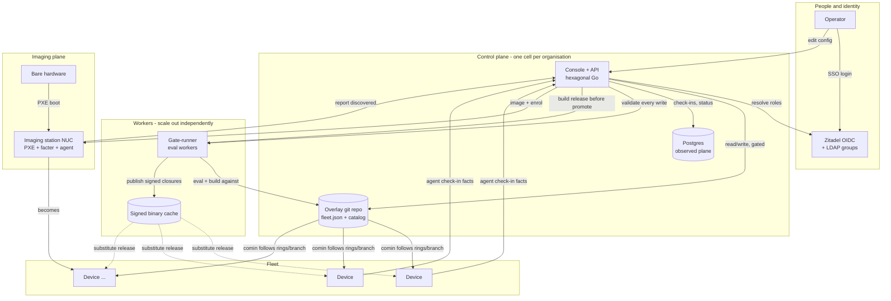
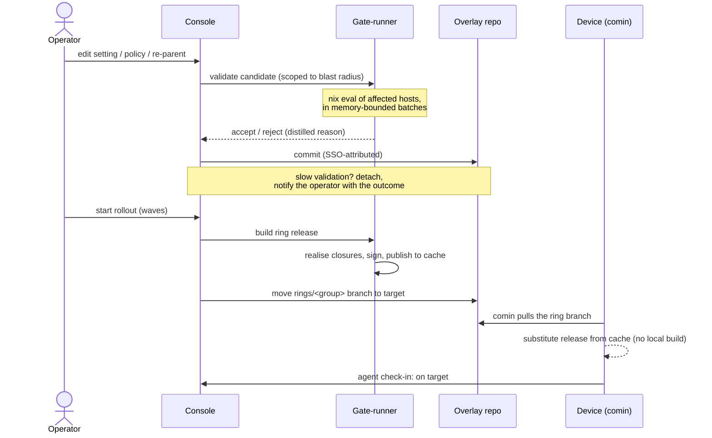

# Architecture overview

Sextant is a hexagonal Go application: a pure domain (model, resolver, policy
compiler, filter evaluator) under application services, behind ports, with
adapters for git, Nix, Postgres, LDAP and OIDC, and two thin transports - a
server-rendered console and a JSON API over the same services.

Three planes carry the work:

- **Config plane** - the git overlay (`fleet.json` + catalog) is the source of
  truth. Writes are serialized, pass the Nix eval gate, and commit with
  SSO-attributed authorship.
- **Observed plane** - device check-ins, posture and hardware facts live in
  Postgres, tenant-namespaced.
- **Imaging plane** - discovery and image jobs provision new hardware from an
  imaging station (the *inspoelstraat*).

## The whole picture

Solid arrows are the steady control flow; dotted arrows are the binary-cache
substitution path that only appears once build-before-promote is enabled.

## How a change reaches a device

## Workers and their knobs

The eval/build work is deliberately its own tier so it scales without touching
the control plane. See [Scaling to 10,000+ devices](./scale.md) for the
measured numbers.

| Worker capability | What it does | Knob |
|---|---|---|
| Batched evaluation | Forces host toplevels in memory-bounded batches, so peak memory is the batch, not the fleet | `gateRunner.chunkSize` |
| Parallel evaluation | Runs batches concurrently across workers; wall-clock divides by worker count | `gateRunner.evalWorkers` |
| Equivalence-class sampling | An org-wide change validates one representative per configuration shape, not every host | automatic |
| Build-before-promote | Builds a ring's release, signs it, publishes to the cache; devices substitute instead of compiling | `releaseCache` + `gateRunner.cache.*` |

A gate-runner is stateless apart from its warm overlay clone and its cache, so
adding capacity is adding a worker; the fail-closed gate lives in the control
plane's availability domain (writes are refused, never committed unvalidated,
when no worker is reachable).

## The imaging station (inspoelstraat)

A station turns bare hardware into an enrolled fleet member. It runs its own
NixOS appliance (PXE, `nixos-facter`, the imaging runner) and the Sextant
agent, and is registered in the fleet so the console can mint its
report credential and offer it as an imaging target.

```mermaid
flowchart LR
    bare[Bare device] -->|1. PXE boot| disc[Discovered<br/>in console]
    disc -->|2. operator picks<br/>hardware profile| job[Image job]
    job -->|3. partition, install,<br/>Secure Boot + TPM2| prov[Provisioned]
    prov -->|4. per-device credential<br/>shown once| enrol[Enrolled device]
    enrol -->|5. agent check-in| fleet[Fleet member]
    fleet -->|6. comin converges| target[On target revision]
```

The station itself is a NixOS host that reports facts and self-updates via
comin, and is tracked in the fleet's `infra` group - Sextant manages the
machine that images the fleet the same way it manages the fleet.

### Reference station

The BB Open reference station, a sizing baseline for a municipal deployment:

| Part | Reference |
|---|---|
| Compute | MSI Cubi barebone (mini-PC) |
| Memory | 16 GB |
| Disk | 500 GB |
| Network | Managed switch for the imaging VLAN, wired to the devices being imaged |
| Role | PXE/imaging + optional eval/build worker (the two never contend: systemd slices give imaging priority) |

A station is modest hardware: imaging is bursty and operator-attended, and a
station doubling as a build worker only runs heavy nix work when no imaging run
is active.

## Multi-tenancy

Each organisation runs as its own **cell** - a private console, database and
overlay repo, no shared process (see
[decision record 0009](./adr.md)). The diagrams above describe one cell;
scaling to many customers is running more cells, managed as declarative data
the same way Sextant manages devices.

See the decision records for the reasoning behind each choice.
